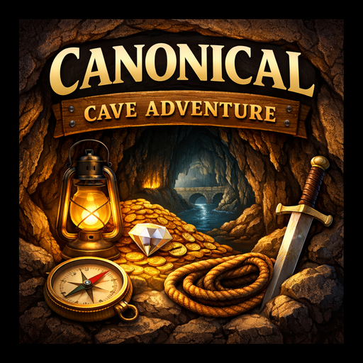
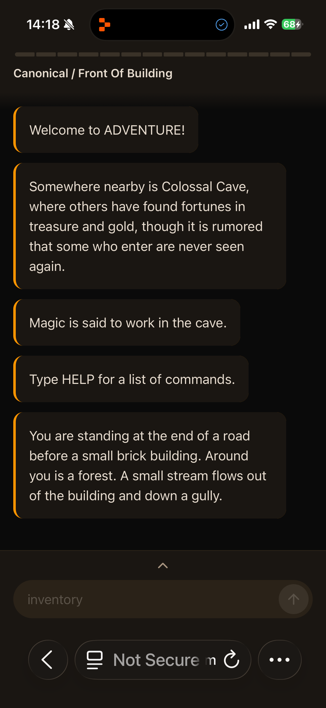
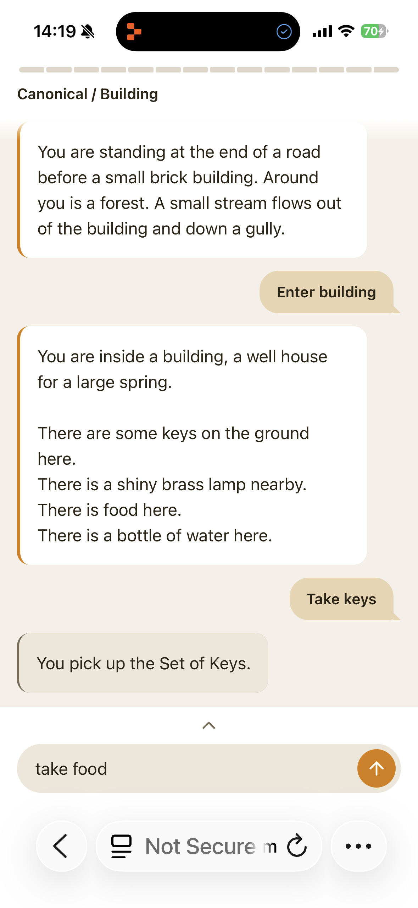
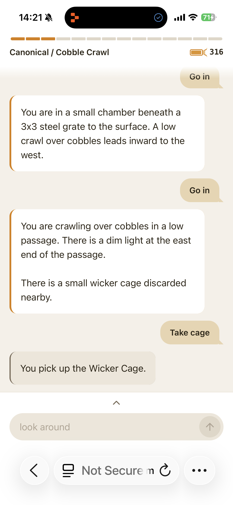

  

<h1 align="center">Canonical Cave Adventure</h1>

  A modern reimagining of the classic text adventure <em>Adventure 2.5</em> / <strong>Open Adventure</strong> 
  with a touch-friendly interface and a forgiving natural language parser.

  <a href="https://nathanpitman.github.io/CanonicalCaveAdventure/"><strong>Play Now</strong></a>

---

## Screenshots

  
  &nbsp;&nbsp;
  
  &nbsp;&nbsp;
  

---

## About

CCA is a reimagining of the classic text adventure *Adventure 2.5* / **Open Adventure** but with a modern touch interface and an improved text parser. This was created by Nathan Pitman as an opportunity to explore what's possible with modern AI led development and a healthy dose of childhood nostalgia.

This is an original game in terms of code, but it uses the cave structure, objects, and descriptions found in the historical *Adventure* text-adventure — *Open Adventure*'s port of *Adventure 2.5*.

---

## Development

CCA has been prompted using ChatGPT and Replit on Apple iOS (iPhone & iPad).

### Forgiving Text Parser (NLP)

The standout feature of CCA is its custom-built natural language processing (NLP) text parser, designed to make the game far more forgiving and accessible than classic text adventures. Rather than demanding exact two-word commands, players can type naturally and still be understood.

**Natural language input** — Type full sentences like *"pick up the golden key"*, *"go through the door"*, or *"use the key on the rusty grate"*. The parser breaks down sentence structure, identifies verbs, objects, targets, and prepositions automatically.

**Stopword & article stripping** — Filler words like *"the"*, *"a"*, *"please"*, *"just"*, and *"some"* are silently removed so casual, conversational input works as well as terse commands.

**Rich verb synonyms** — Dozens of synonyms are mapped to canonical verbs. For example, *"grab"*, *"snag"*, *"retrieve"*, *"collect"*, and *"pick up"* all resolve to **take**. Similarly, *"inspect"*, *"examine"*, *"observe"*, and *"where am I"* all resolve to **look**.

**Direction & movement synonyms** — Compass shortcuts (*n*, *s*, *e*, *w*, *ne*, *sw*, etc.), full words (*north*, *south*), suffixed forms (*northward*, *upwards*), and natural phrases like *"follow the stream downstream"* or *"climb up"* are all understood.

**Narrative location synonyms** — Descriptive phrases are mapped to game locations, so *"follow the stream"*, *"down the stream"*, *"crawlspace"*, *"staircase"*, *"passageway"*, *"corridor"*, and many more resolve to the correct destination.

**Noun & object synonyms** — Multiple names for the same thing work interchangeably. For example, *"building"*, *"house"*, and *"wellhouse"* all refer to the same location. *"Cavern"* and *"cave"* are equivalent, as are *"crevice"*, *"fissure"*, and *"crack"*.

**Fuzzy matching with typo correction** — A Damerau-Levenshtein edit-distance algorithm tolerates up to 2 character typos. If you mistype a command, the parser auto-corrects and tells you what it did — e.g. *(interpreting 'lampp' as 'lamp')*.

**Keyboard-proximity-aware matching** — On top of standard edit distance, a QWERTY-aware algorithm recognizes that typos caused by hitting a neighboring key are more likely than distant key substitutions. Adjacent-key swaps (like *o↔p*, *i↔u*, *t↔y*) are penalized at half the cost of unrelated character swaps. This means *"go pit"* correctly resolves to *"go out"* because *p* is next to *o* and *i* is next to *u* on the keyboard — even though standard edit distance treats all substitutions equally.

**"Did you mean?" suggestions** — When the parser is less confident about a fuzzy match, it offers a helpful suggestion instead of a dead end — e.g. *"You don't see that here. Did you mean 'keys'?"*

**Singular & plural normalization** — *"keys"* matches *"key"*, *"torches"* matches *"torch"*. The parser automatically generates singular and plural word forms so either version works.

**Structured multi-object commands** — Complex *verb-item-preposition-target* patterns are fully supported: *"unlock the chest with the key"*, *"throw the axe at the dwarf"*, *"pour water on the plant"*, and similar constructions all parse correctly.

**Context-aware action resolution** — The resolver doesn't just parse words — it checks what actions are actually available in the current scene and what items are in your inventory before matching. This prevents impossible actions and provides meaningful feedback.

**Inventory-aware fuzzy matching** — When you type *"use"* or *"drop"*, fuzzy matching runs specifically against items you're carrying, so near-misses resolve to the right object in your bag rather than something elsewhere in the cave.

**Magic words & classic adventure verbs** — All the classic *Adventure* magic words are supported: *xyzzy*, *plugh*, *fee/fie/foe/foo/fum*, *sesame*, *abracadabra*, *shazam*, and more — typed as bare words or with *"say"* / *"speak"*.

**Lamp toggle patterns** — Many natural ways to control the lamp are recognized: *"turn on the lamp"*, *"light the lantern"*, *"extinguish torch"*, *"douse lamp"*, and all variations across lamp/lantern/torch synonyms.

**Flexible meta-commands** — Inventory can be checked with *"i"*, *"inventory"*, *"bag"*, *"backpack"*, *"what am I carrying?"*, or *"my items"*. Help can be accessed with *"?"*, *"help"*, *"commands"*, or *"how to play"*.

---

## Acknowledgements

This project takes inspiration from:

- **Open Adventure** — a modern C forward-port of the *Adventure 2.5* codebase originally developed by Will Crowther and Don Woods, updated and maintained by Eric S. Raymond and contributors. [LibreGameWiki](https://libregamewiki.org/Open_Adventure)

While this project does **not reuse code** from the Open Adventure repository, it references the cave structure and object descriptions that have been historically part of the *Adventure* lineage.

---

## License

This project is released under the **2-Clause BSD License**.

### Copyright

Based on the Open Adventure project (forward-port of Adventure 2.5, originally by Will Crowther & Don Woods, modernized by Eric S. Raymond et al.).

## Attribution

This project was inspired by:

- **Open Adventure** — forward-port of *Adventure 2.5* (1995) under the 2-Clause BSD License. [LibreGameWiki](https://libregamewiki.org/Open_Adventure)

---

## Contact

If you find bugs, would like to contribute, or have questions about this project, please open an issue or contact me via hello@nathanpitman.com.
